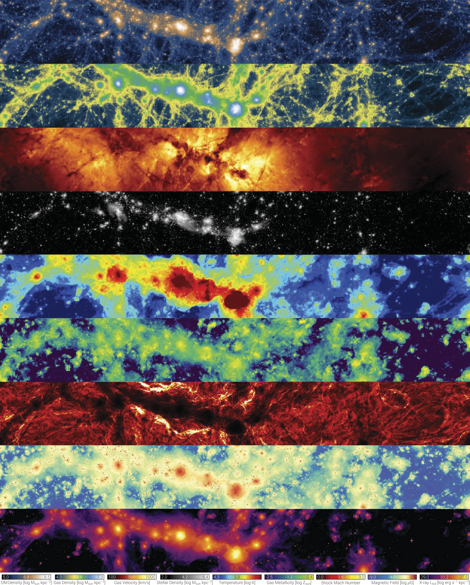

# **Getting to know the data**

Papers referred-

-  - About IllustrisTNG simulations
-  - About TNG50 data release
-  - About MW and Andromeda like analogues in TNG50

## Introduction 

The IllustrisTNG Project (released in 2019) is a state-of-art suite of large volume, cosmological, magnetohydrodynamical simulation (coupled with self-gravity) which provides a comprehensive model for galaxy formation physics, which is able to follow the formation and evolution of galaxies across cosmic time. Each simulation in TNG, self-consistently progresses by solving the coupled evolution of dark matter, cosmic gas, luminous stars, and supermassive BHs from early time (_snap = 0_) to present day $z=0$ ( _snap = 99_ ); using a moving mesh code called `AREPO`. ([Nelson et. al, 2019](https://doi.org/10.1186/s40668-019-0028-x))

!!! note " About `AREPO`  ([Springel, 2010](https://doi.org/10.1111/j.1365-2966.2009.15715.x))"

    AREPO is a cosmological hydrodynamic simulation framework designed to overcome the inherent drawbacks of traditional smoothed particle hydrodynamics (SPH) and adaptive mesh refinement (AMR), such as suppressed fluid instabilities, numerical overmixing, and broken Galilean invariance. The code operates on a moving unstructured mesh generated by the Voronoi tessellation of discrete points, solving ideal hydrodynamics conservation laws through a second-order unsplit Godunov finite-volume scheme with an exact Riemann solver. 
    
    By allowing its mesh-generating points to drift alongside the local fluid velocity, AREPO realizes a Lagrangian formulation free from the grid distortion limitations of traditional mesh-based methods. This design ensures full Galilean invariance—essential for accurately modeling supersonic bulk flows in cosmological structure growth—while simultaneously retaining the continuous, adaptive spatial resolution of SPH and the superior shock-capturing accuracy of Eulerian schemes. Parallelized for distributed-memory architectures in both 2D and 3D, AREPO features adaptive mesh refinement and de-refinement, individual time-stepping, and a high-precision self-gravity solver that integrates smoothly with collisionless dark matter dynamics, offering a powerful alternative to conventional astrophysical simulation methods.

<!--IMAGE  -->

{: .center}

*__Figure 1__ — The panels illustrate a range of physical quantities accessible in the TNG simulations. From top: dark matter density, gas density, gas velocity field, stellar mass density, gas temperature, gas-phase metallicity, shock Mach number, magnetic field strength, and X-ray luminosity. Each panel corresponds to the same region of the TNG100-1 run at redshift $z=0$, covering a volume of $\sim 110 \times 14 \times 37 \ \rm Mpc$. [Credits: [Nelson et. al, 2019](https://doi.org/10.1186/s40668-019-0028-x)]*
{: style="text-align: center;"}

<!--  -->

This project is made up of three simulation volumes: TNG50, TNG100 and TNG300. The numbers denote the corresponding _simulation-box side length in comoving Mpc_. The three boxes complement one another by balancing physical volume against numerical resolution to address different aspects of galaxy formation.

* **TNG300** Provides the largest volume, making it ideal for examining galaxy clustering, sampling rare massive objects like galaxy clusters, and building broad statistical datasets.
* **TNG100** Employs the same initial conditions as the original Illustris simulation, delivering an optimal compromise between volume and resolution for general galaxy evolution research.
* **TNG50** Sacrifices physical size to achieve a mass resolution more than 100 times finer than TNG300, enabling detailed analysis of internal galaxy structures and small-scale gas phenomena in and around galaxies.

## About TNG50

TNG50 is the third and final volume of the IllustrisTNG project, with over 20 billion resolution elements and capturing spatial scales of upto $100$ parsecs. Evolved within a cubic volume of $51.7^3\text{ comoving Mpc}^3$ (or $35\text{ cMpc}/h$ on a side), it bridges the gap between large-volume cosmological runs and high-resolution "zoom-in" simulations of single galaxies. TNG50 tracks the co-evolution of cold dark matter, cosmic gas, stars, supermassive black holes (SMBHs), and magnetic field from a starting redshift of $z=127$ to the present day ($z=0$). The separation between two subsequent snapshots at low redshift is about $150$ Myr. 

### Physical Models and Numerical Methods

Directy quoting from [Nelson et. al, 2019](https://doi.org/10.1186/s40668-019-0028-x), all of the baryonic TNG runs include the following additional physical components: 

1. Primordial and metal-line radiative cooling in the presence of an ionizing background radiation field which is redshift-dependent and spatially uniform, with additional self-shielding corrections. 
1. Stochastic star formation in dense ISM gas above a threshold density criterion. 
1. Pressurization of the ISM due to unresolved supernovae using an effective equation of state model for the two-phase medium. 
1. Evolution of stellar populations, with associated chemical enrichment and mass loss (gas recycling), accounting for SN Ia/II, AGB stars, and NS-NS mergers.
1. Stellar feedback: galactic-scale outflows with an energy-driven, kinetic wind scheme.
1. Seeding and growth of supermassive black holes.
1. Supermassive black hole feedback: accreting BHs release energy in two modes, at high-accretion rates (‘quasar’ mode) and low-accretion rates (‘kinetic wind’ mode). Radiative proximity effects from AGN affect nearby gas cooling.
1. Magnetic fields: amplification of a small, primordial seed field and dynamical impact under the assumption of ideal MHD.

### Key Resolution Metrics of TNG50 

Summarised from [Pillepich et al. (2024)](https://doi.org/10.1093/mnras/stae2165)

*   **Baryon Mass Resolution:** Gas cells and stellar particles are resolved down to a target mass of $8.5 \times 10^4 M_\odot$.
*   **Dark Matter Mass Resolution:** Set at $4.6 \times 10^5 M_\odot$ per DM particle.
*   **Spatial Resolution:** The physical gravitational softening length is $290\text{ pc}$ (or $0.29\text{ kpc}$) for stellar and dark matter particles at redshift $z < 1$. The gas cell spatial resolution is fully adaptive, reaching as fine as $10–20\text{ pc}$ in the densest regions, with an average resolution of $150\text{ pc}$ in star-forming environments.

## Fiducial Selection of Milky Way and Andromeda (MW/M31) Analogues

To investigate analogues of our Galaxy and Andromeda without the typical a-priori selection biases of zoom-in simulations, [Pillepich et al. (2024)](https://doi.org/10.1093/mnras/stae2165) propose a three-pronged, observable-based selection at $z=0$:

1.  **Stellar Mass:** The galaxy's stellar mass (evaluated within a spherical aperture of $30\text{ kpc}$) must lie within $M_* = 10^{10.5} - 10^{11.2} M_\odot$. MW-like galaxies are classified below $10^{10.9} M_\odot$, while M31-like galaxies occupy the range above.
2.  **Stellar Morphology:** The stellar distribution must display a disky shape and spiral features. This is enforced by requiring either a minor-to-major stellar axis ratio $c/a \le 0.45$ (measured at $1-2$ times the stellar half-mass radius) or positive identification via visual inspection of mock 3-band stellar light images.
3.  **Environment:** The environment must mimic Local Group-like isolation. This requires no other massive galaxy ($M_* \ge 10^{10.5} M_\odot$) to reside within $500\text{ kpc}$, and the host halo mass must be $M_{\text{200c}} < 10^{13} M_\odot$ to avoid group or cluster environments.

This selection identifies exactly **198 MW/M31 analogues** at $z=0$ in TNG50. Among these, **138 are MW-like** and **60 are M31-like**. The sample includes **190 central galaxies** and **8 satellites** (located $\ge 500\text{ kpc}$ from their primary hosts), with three pairs forming serendipitous Local Group analogues.

<!-- ## Model Assumptions

While highly sophisticated, several simplifications and assumptions are built directly into the TNG simulations:

1.  **Cosmology:** The suite assumes flat $\Lambda$CDM cosmological parameters consistent with Planck 2015/2016 results: $\Omega_{\Lambda,0} = 0.6911$, $\Omega_{m,0} = 0.3089$, $\Omega_{b,0} = 0.0486$, $\sigma_8 = 0.8159$, $n_s = 0.9667$, and $h = 0.6774$.
2.  **Stellar IMF:** Stellar populations are assumed to follow a **Chabrier Initial Mass Function (IMF)**.
3.  **Unresolved ISM Phase:** Subgrid modeling approximates the cold ($T < 10^4\text{ K}$) molecular and atomic interstellar medium. This phase is not directly resolved in the hydrodynamics; instead, an effective equation of state governs star-forming gas.
4.  **Stellar Particles:** Each stellar particle in the simulation represents a **mono-age stellar population** of ~ $8.5 \times 10^4 M_\odot$, rather than individual physical stars.
5.  **Wind Decoupling:** Launched winds are hydrodynamically decoupled from the surrounding gas cells until they leave the dense star-forming environment to bypass spatial resolution limitations.
6.  **UV Background Timing:** The uniform UV background radiation field is turned on in a step-like fashion only at **$z < 6$**. -->

### Words of caution

[Pillepich et al. (2024)](https://doi.org/10.1093/mnras/stae2165) warn readers and data-analysts of several subtle physical and numerical limitations when working with TNG50 data and MW/M31-like systems:

*   **SMBH Mass Mismatch for Sgr $A^*$:** Due to a tight Magorrian relation calibrated into the TNG code, **no TNG50 MW/M31 analogues host an SMBH as small as the Milky Way’s** ($\approx 4 \times 10^6 M_\odot$). TNG50 black holes in this mass range instead span $10^{7.5} - 10^{8.7} M_\odot$. Studies relying strictly on the exact mass of Sgr $A^*$ are limited.
*   **Alpha Abundances ($\alpha$-Enhancement):** Stellar populations in MW-like galaxies in TNG are **too alpha-enhanced** (specifically in $[\text{Mg/Fe}]$ ratios) compared to observations of the Milky Way, likely due to SN II yield or SN Ia rate modeling choices.
*   **Lack of Cold Gas ($T < 10^4\text{ K}$):** Gas colder than $10^4\text{ K}$ is not physically tracked in the simulation. This limits direct modeling of dense molecular clouds or giant molecular clouds (GMCs). Molecular hydrogen content (such as $\text{H}_2$ transitions) must be inferred via post-processing models.
*   **Spurious Clumps & Satellite Identification (`SubhaloFlag`):** Satellite galaxies identified by the SUBFIND algorithm are not all of cosmological origin. Some are baryon-dominated fragments produced through disk instabilities. Users must enforce the **`SubhaloFlag`** field to filter out these non-cosmological clumps, especially in satellite population analyses.
*   **Limitations of Metal Tagging:** The SN Ia, SN II, and AGB metal tagging fields record which type of star last ejected the element, **not where the element was originally created**. For example, iron produced in earlier SN Ia can be taken up and re-ejected by later AGB winds.
*   **Hubble Flow & Low-Temperature IGM Spurious Cooling:** Spurious energy injections and numerical cooling occurred in low-density intergalactic gas and low-temperature gas cells near the cooling floor. These have been corrected in post-processing for $z \le 5$, with original values preserved under `InternalEnergyOld`.
*   **High-z UV Background:** Because the UV background is enabled only at $z < 6$, reionization-era studies of the gas density-temperature phase diagrams above redshift 6 must be treated with caution.
*   **Resolution Convergence:** Physical properties can converge differently depending on the mass regime, redshift, and scale. Comparing across different boxes (e.g., TNG100 vs. TNG50) require careful handling and resolution correction procedures.
